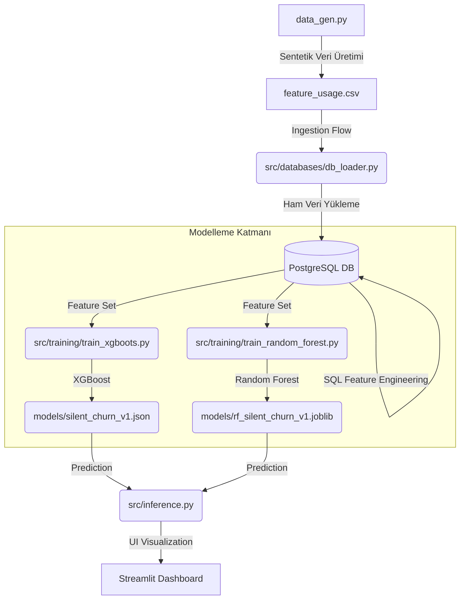

# 📊 Silent Churn Prediction & Monitoring System

##  Proje Hakkında (Executive Summary)

Bu proje, bir platformun kullanıcı tutundurma (retention) stratejisini güçlendirmek amacıyla, aboneliğini iptal etmeyen ancak kullanım sıklığı veya süresi gizlice azalan (**Silent Churn**) kullanıcıları tespit etmek için geliştirilmiştir.

Geleneksel "açık churn" modellerinden farklı olarak, bu sistem kullanıcıların davranışsal verilerindeki negatif trendleri (özellikle `usage_drop_rate`) analiz eder. Veri kümesindeki aşırı sınıf dengesizliğine (%1.84 churn oranı) rağmen, yüksek **Recall** odaklı mühendislik yaklaşımları kullanılarak, işletmeye müdahale şansı tanıyan "riskli kullanıcı listeleri" üretilir.

###  Çözülen Problem & İş Değeri
* **İş Problemi:** Kullanıcılar bir platformu kullanmayı bıraktıklarında genellikle aboneliklerini hemen iptal etmezler, bu da gelir kaybına yol açar.
* **Mühendislik Çözümü:** Bu sistem, ham kullanım günlüklerini işleyerek (features) yüksek riskli kullanıcıları (labels) belirler ve bu riskli kullanıcıların analizini sağlayan interaktif bir dashboard sunar.
* **Prioritize Edilen Metrik: RECALL (Sınıf 1).** Bir bilgisayar mühendisi olarak şu kararı verdim: "Kullanıcının sessizce gitmesini (False Negative) kaçırmaktansa, bazen sağlıklı müşteriye 'bir sorun mu var?' diye sormayı (False Positive) tercih ederim".

---

##  Proje Mimarisi & Veri Akışı (Architectural Diagram)

Proje, tam modüler ve ölçeklenebilir bir MLOps yapısına sahiptir. Ham verinin üretiminden son kullanıcının raporu görmesine kadar 4 ana katmandan oluşur.

 
